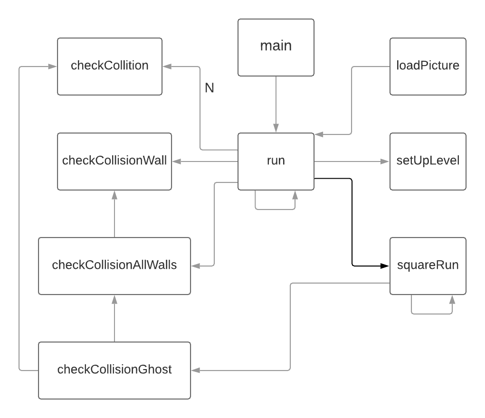
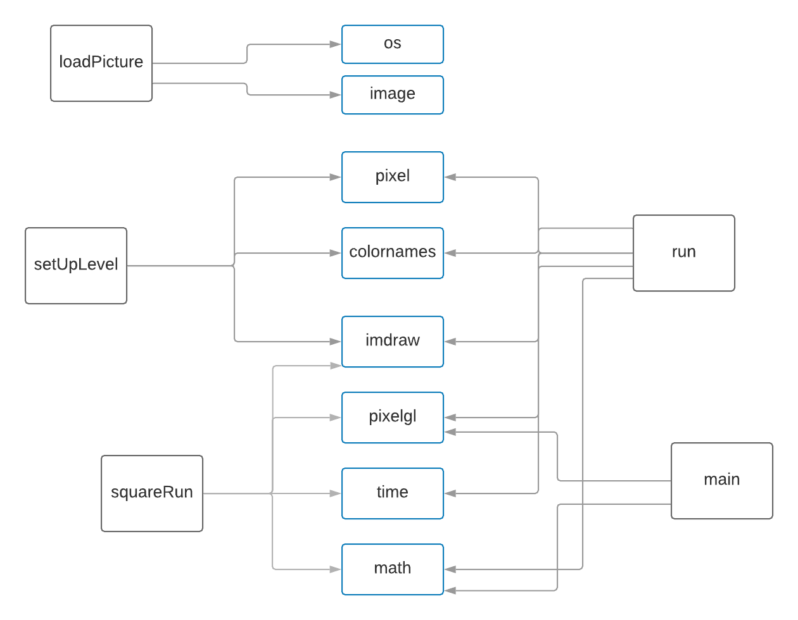

# ARCHITECTURE

pacman.go

External libraries

## METHODS
### loadPicture(path string) (pixel.Picture, error)
Opens image in path, creates a pixel.Picture object with the image and returns pixel.Picture and error if any.

### checkCollision(vec1, vec2 pixel.Vec) (bool)
Checks pixel collision between vec1 and vec2

### checkCollisionWall(vec pixel.Vec, rect pixel.Rect) (bool) 
Uses bounding box algorithm to check collision between a vector and a box.

### checkCollisionAllWalls(vec pixel.Vec) (bool)
Calls checkCollisionWall for every wall in the map.

### checkCollisionGhost(vec pixel.Vec) (bool)
Calls checkCollisionWall for each wall and if they collide with pacman, game ends.

### setUpLevel() ()
Declares all static nodes and walls.

### squareRun(pos pixel.Vec, win *pixelgl.Window) ()
Runs in a thread. Is the controller for each ghost, deciding collisions and movement. Implements pathfinding AI.

### run() ()
Detects collision with walls and food and receive input from user to control pacman. Main execution loop.

### main() ()
Receive input from console to decide how many ghosts to spawn, declares random seed and calls run.